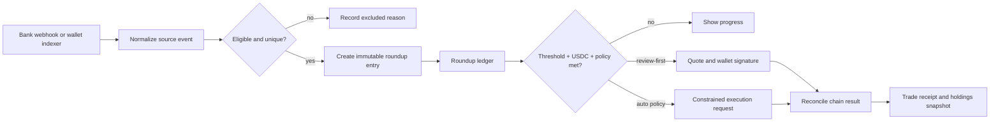

# Roundup portfolio — system design draft

Status: planning/WIP only. This describes the intended approval boundary before any live bank connection or trading integration.

## Product invariant

A source transaction can create a **roundup entry**. A roundup entry is a calculation, never money movement. It becomes investable only when the user's wallet has sufficient USDC and the chosen execution path is allowed by the active approval policy.

## Event path

## Core records

| Record | Purpose | Key safety property |
| --- | --- | --- |
| `source_event` | Normalized posted bank or confirmed wallet activity | Provider ID / transaction signature unique per source |
| `roundup_entry` | The calculated contribution from one event | Immutable source and rule version |
| `funding_snapshot` | Available USDC for a wallet | Never infer this from the roundup total |
| `allocation_plan` | Assets and target percentages | Versioned, weights total 100% |
| `approval_policy` | Limits the automatic execution authority | Signed version; revocable and expires |
| `purchase_batch` | The set of roundup entries consumed by a trade | Entries cannot be consumed twice |
| `trade_leg` | One asset purchase and chain outcome | Idempotency key and signature/state checks |

## Decision for each event

1. Accept only posted bank purchases or confirmed supported onchain payments.
2. Deduplicate, screen transfers/top-ups/refunds/app-originated investment flows, and save an exclusion reason when rejected.
3. Calculate the roundup using the active plan version at event time.
4. Add it to the ledger. Do not debit a bank account or assume the user has USDC.
5. When the ledger and real USDC balance clear the configured minimum, compute the allocation drift using confirmed wallet holdings.
6. Buy the allowed asset or assets with the largest shortfall relative to the target allocation, subject to the policy caps and a fresh quote.
7. Reconcile each trade leg from chain status before marking roundup entries invested.

## Approval model

### Review-first

The user sees the source events, allocation, quote, fees, and minimum received, then signs that particular transaction. A declined signature leaves the ledger intact.

### Event-driven auto-invest

The user signs an `approval_policy` once. It authorizes only future execution matching all of these values:

- selected funding wallet and destination wallet
- eligible sources and roundup rule version
- asset mint allowlist and target percentages
- minimum trade amount, per-event cap, daily cap, and weekly cap
- maximum slippage, quote freshness, and expiry
- no arbitrary recipient, asset, or increased limit

The policy has an immediate pause/revoke path. A new signature is required to add an asset, increase a cap, loosen slippage, change a wallet, or extend expiry. Every execution creates a readable receipt explaining the source events, amount, target drift, quote, transaction(s), and remaining limits.

## Trust boundaries

- **Client:** renders balances and initiates connection/signature requests. It never decides eligibility or provides an arbitrary executable transaction to the server.
- **API/worker:** receives webhooks, normalizes/deduplicates events, calculates ledger state, evaluates policy, obtains quotes, and reconciles chain state. Bank tokens and provider credentials remain encrypted here.
- **Wallet / constrained execution authority:** controls asset movement. A general SPL delegate is insufficient for automatic investing because it cannot enforce the portfolio policy by itself.
- **Indexer/quote/execution providers:** are replaceable adapters; raw data is retained with provenance so a provider retry cannot duplicate an investment.

## Explicit non-goals for the hackathon WIP

- Do not imply bank data can debit a bank account.
- Do not claim a US user can currently buy xStocks; current issuer terms and the execution provider must be verified separately.
- Do not automate from a private key we hold.
- Do not silently sell a position to restore a target weight; v1 uses new contributions only.
